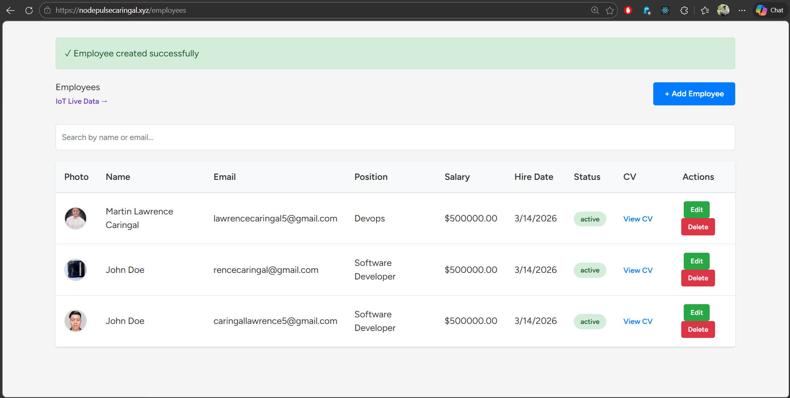
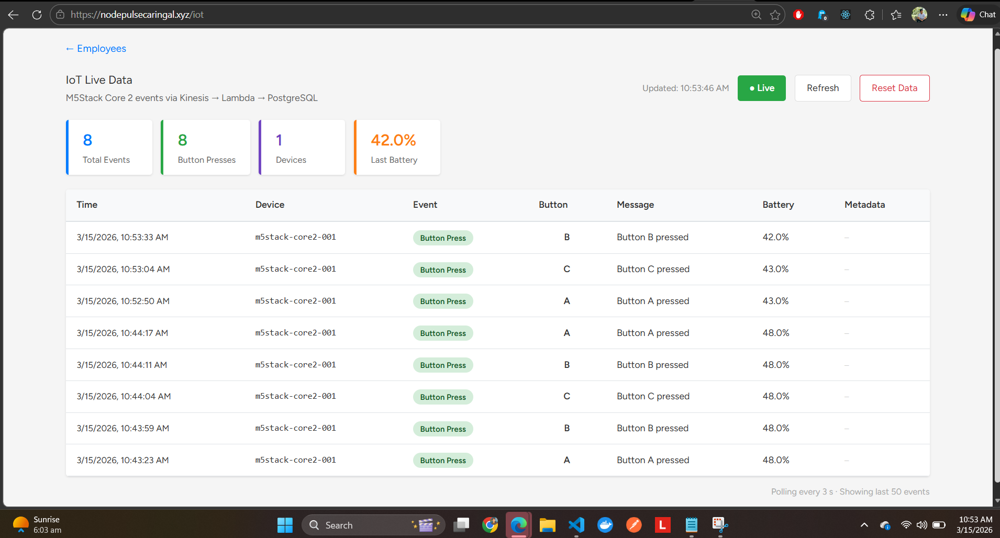
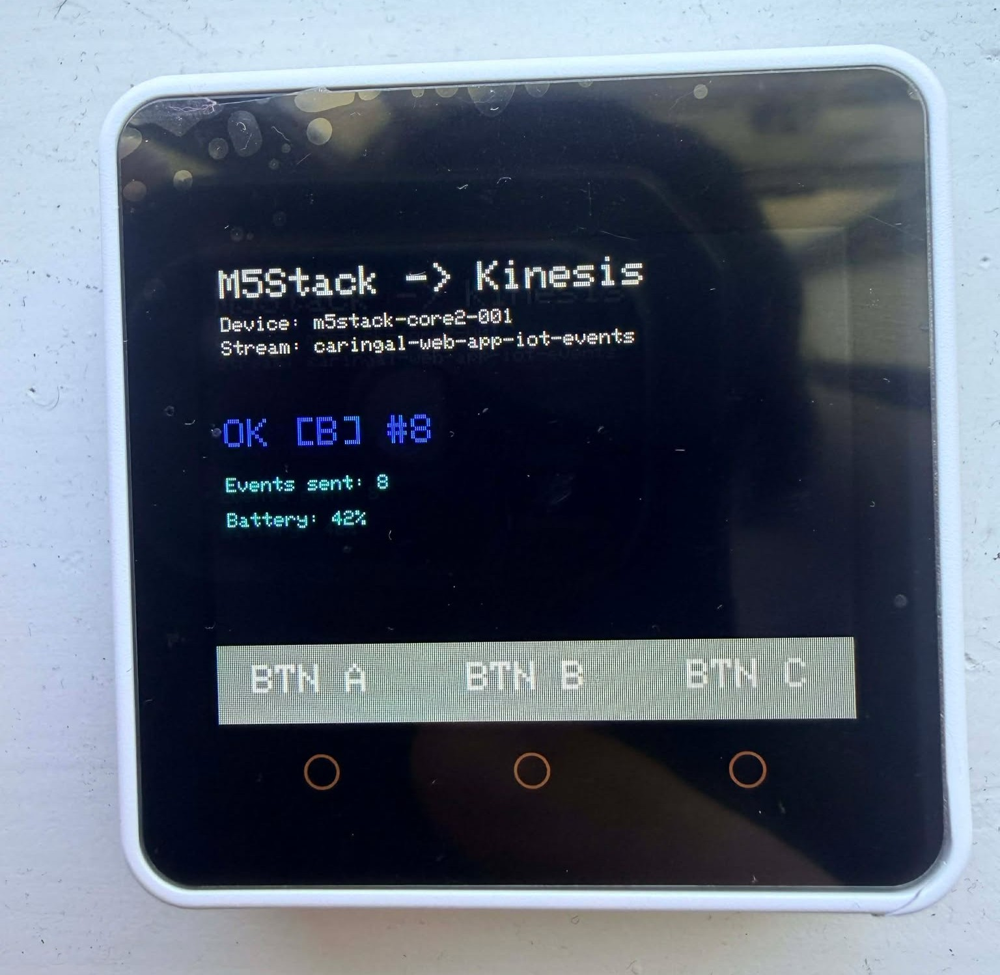
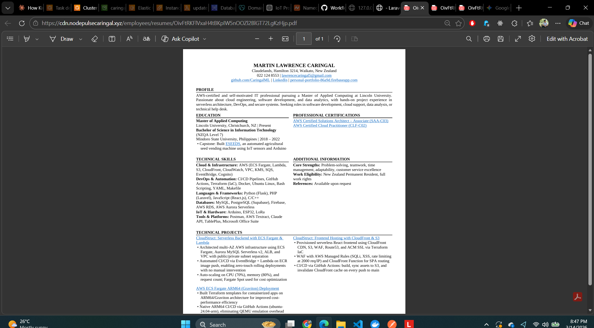

# Employee CRUD — Laravel + Inertia.js + React on AWS ECS (EC2 Graviton)

A full-stack employee management application with **profile photo and CV/resume uploads**. Built with Laravel 11, Inertia.js + React 18, and PostgreSQL. Containerized with Docker and deployed to **AWS ECS on self-managed EC2 Graviton (ARM64)** via Terraform.

Live at: **https://nodepulsecaringal.xyz**

---

## Screenshots

### Employee List


### IoT Live Data Dashboard


### M5Stack Core 2 Hardware


### CV / Resume Viewer (served via CloudFront CDN)


---

## Tech Stack

| Layer              | Technology                                                        |
| ------------------ | ----------------------------------------------------------------- |
| Backend            | Laravel 11 (PHP 8.2)                                              |
| Frontend           | React 18 + Inertia.js (SPA, no full-page reloads)                |
| Database           | AWS RDS PostgreSQL 15 (t4g.micro, Graviton)                       |
| File Storage       | AWS S3 Standard-IA + CloudFront CDN (OAC)                         |
| Security           | AWS WAFv2 — OWASP Top 10, SQLi, Known Bad Inputs, rate limiting   |
| CSS                | Tailwind CSS                                                      |
| Containerization   | Docker — multi-stage (Node → Composer → PHP-FPM/Nginx/Supervisor) |
| CI/CD              | GitHub Actions → ECR → EventBridge → Lambda → ECS                |
| Infrastructure     | Terraform (AWS provider v5)                                       |
| Container Registry | AWS ECR (lifecycle: keeps 2 most recent images)                   |
| Compute            | AWS ECS EC2 launch type — Graviton3 ARM64, mixed On-Demand + Spot |
| IoT Hardware       | M5Stack Core 2 (ESP32, touchscreen) — Arduino + AWS SigV4        |
| IoT Ingestion      | AWS Kinesis Data Streams → Lambda (Python, pg8000) → PostgreSQL   |

---

## Features

- **Employee CRUD** — create, read, update, delete employees
- **Profile photo upload** — stored in S3, served via CloudFront CDN
- **CV / resume upload** — PDF/DOC/DOCX, viewable directly in browser via CloudFront
- **Live search** — client-side filter by name or email
- **Status badges** — active / inactive with colour coding
- **Secure secrets** — APP_KEY and DB credentials injected at runtime from AWS Secrets Manager (never in the image or environment variables plaintext)
- **IoT Live Data** — M5Stack Core 2 sends button press events via Kinesis → Lambda → PostgreSQL; React dashboard polls every 3s showing device, event type, button, battery, and timestamp
- **Reset IoT Data** — one-click button to truncate IoT events table for a fresh slate
- **WAF protection** — AWS WAFv2 on ALB: OWASP Top 10, SQLi, Known Bad Inputs, IP reputation, per-IP rate limiting (2000 req/5min)

---

## Architecture Overview

```
Internet
   │
   ▼
Route53 (nodepulsecaringal.xyz)
   │  Alias record → ALB
   ▼
Application Load Balancer (HTTPS 443, ACM cert)
   │  HTTP → HTTPS redirect
   ▼
AWS WAFv2 (Regional)
   │  OWASP rules, SQLi, rate limit, IP reputation
   ▼
ECS Service (awsvpc, 1 task)
   │
   ├── EC2 ASG (Graviton ARM64)
   │     1 On-Demand base + Spot scale-out
   │     t4g.micro / t4g.small
   │
   └── Container: Nginx + PHP-FPM + Supervisor
         ├── Laravel 11 app
         ├── Secrets injected by ECS agent (Secrets Manager)
         └── S3 Gateway Endpoint → S3 bucket (free, no NAT cost)

cdn.nodepulsecaringal.xyz
   │  Route53 Alias → CloudFront
   ▼
CloudFront Distribution (OAC, SigV4)
   └── S3 bucket (private, Standard-IA after 30 days)

CI/CD:
GitHub Actions → ECR push → EventBridge → Lambda
   └── RegisterTaskDefinition + UpdateService (force redeploy)

IoT Pipeline:
M5Stack Core 2 (ESP32, AWS SigV4 over HTTPS)
   │  PutRecord
   ▼
Kinesis Data Stream (1 shard, 24h retention)
   │  Event Source Mapping (pull, batch 10)
   ▼
Lambda — kinesis-to-rds (Python 3.11, ARM64, in VPC)
   │  INSERT INTO iot_events
   ▼
RDS PostgreSQL (private subnet)
   │  SELECT via Laravel IotEventController
   ▼
React IoT page (polls /iot-events every 3s)
```

---

## Project Structure

```
├── app/
│   ├── Http/Controllers/EmployeeController.php   # CRUD + S3 file upload/delete
│   ├── Http/Controllers/IotEventController.php   # IoT events JSON API + Inertia page
│   ├── Http/Middleware/HandleInertiaRequests.php  # Flash message sharing
│   ├── Models/Employee.php                        # profile_photo_url / resume_url appended
│   └── Models/IotEvent.php                        # iot_events table model
├── bootstrap/
│   └── app.php                                    # TrustProxies for ALB SSL termination
├── resources/js/Pages/Employees/
│   ├── Index.jsx                                  # List with photo avatar + CV link
│   ├── Create.jsx                                 # Create form with file inputs + preview
│   └── Edit.jsx                                   # Edit form with current file display
├── resources/js/Pages/IoT/
│   └── Index.jsx                                  # Live IoT dashboard, polls every 3s
├── routes/web.php                                 # /health endpoint for ALB checks
├── database/migrations/
│   └── 2026_03_14_000001_add_files_to_employees_table.php
├── terraform-aws/
│   ├── versions.tf          # Provider versions, aws.us_east_1 alias for CloudFront ACM
│   ├── variables.tf         # All configurable variables with defaults
│   ├── terraform.tfvars     # Your values (gitignored)
│   ├── vpc.tf               # VPC, 2 public + 2 private subnets, IGW, NAT, route tables
│   ├── security-group.tf    # ALB SG (80/443), ECS tasks SG, RDS SG, EC2 instances SG
│   ├── cluster.tf           # ECS cluster, launch template, ASG (mixed), capacity provider
│   ├── ecs-self-managed-service.tf  # ECS service, ALB target group registration
│   ├── task-definition.tf   # Container spec: ARM64, env vars, secrets, health check
│   ├── alb.tf               # ALB, listeners (HTTP→HTTPS redirect, HTTPS→ECS)
│   ├── acm.tf               # ACM cert (ap-southeast-2) + DNS validation via Route53
│   ├── route53.tf           # Alias records for apex + www → ALB
│   ├── rds.tf               # RDS PostgreSQL 15, t4g.micro, Multi-AZ off, private subnet
│   ├── secretsmanager.tf    # app_secrets (APP_KEY) + db_credentials (host/user/pass/etc.)
│   ├── s3.tf                # Private media bucket, Standard-IA lifecycle, CORS, Gateway Endpoint, bucket policy
│   ├── cloudfront.tf        # CloudFront OAC distribution, ACM cert (us-east-1), cdn.* alias
│   ├── ecr.tf               # ECR repo + lifecycle (keep 2 images) + VPC interface endpoints
│   ├── iam.tf               # Task execution role, task role (S3 + Secrets), Lambda role, EC2 instance profile
│   ├── lambda.tf            # Lambda + EventBridge trigger: auto-update ECS task def on ECR push
│   ├── lambda-iot.tf        # IoT Lambda in VPC + Kinesis ESM + SG rules
│   ├── kinesis.tf           # Kinesis Data Stream + IAM user for M5Stack device
│   ├── lambda-python/kinesis-to-rds/handler.py     # Lambda: decode Kinesis → INSERT iot_events
│   ├── eventbridge.tf       # ECR image push rule → Lambda target
│   ├── cloudwatch.tf        # Log group + CloudWatch alarms (CPU, memory)
│   ├── backup.tf            # AWS Backup plan (conditional on enable_backup)
│   ├── waf.tf               # WAFv2 Web ACL — OWASP, SQLi, rate limit, body size monitor
│   └── outputs.tf           # ALB DNS, ECR URL, RDS endpoint, CloudFront domain
├── hardware/
│   └── m5stack/m5stack_kinesis.ino   # Arduino sketch: SigV4, Kinesis PutRecord, touchscreen UI
├── docker/
│   ├── nginx.conf           # Nginx: PHP-FPM pass, static asset caching, .php location
│   ├── supervisord.conf     # Runs nginx + php-fpm under supervisor
│   └── entrypoint.sh        # APP_KEY check, storage:link, route:cache, view:cache, migrate
├── .github/workflows/deploy.yml   # CI/CD pipeline
└── Dockerfile                     # 3-stage: frontend / composer / production
```

---

## Local Development

### Prerequisites

- PHP 8.2+, Composer
- Node.js 20+
- A local PostgreSQL instance

### 1. Install Dependencies

```bash
composer install
npm install
```

### 2. Configure Environment

Copy `.env.example` to `.env`:

```env
APP_KEY=          # generate with: php artisan key:generate
APP_URL=http://127.0.0.1:8000

DB_CONNECTION=pgsql
DB_HOST=127.0.0.1
DB_PORT=5432
DB_DATABASE=your_db
DB_USERNAME=your_user
DB_PASSWORD=your_password

# Use local public disk for file uploads (S3 is production-only)
FILESYSTEM_DISK=public
```

### 3. Run Migrations and Link Storage

```bash
php artisan migrate
php artisan storage:link
```

### 4. Start Servers

```bash
php artisan serve
npm run dev
```

Visit `http://127.0.0.1:8000/employees`

> **Note:** `FILESYSTEM_DISK=public` stores uploads in `storage/app/public` and serves them via `/storage/...`. In production, `FILESYSTEM_DISK=s3` stores them in S3 and serves via CloudFront. The `Storage::url()` call in the model handles both automatically.

---

## Docker

### Build Locally (ARM64)

```bash
docker build --platform linux/arm64 -t employee-crud .
```

### Run Locally

```bash
docker run -p 80:80 --env-file .env employee-crud
```

### Multi-Stage Build

| Stage        | Base Image           | Purpose                                      |
| ------------ | -------------------- | -------------------------------------------- |
| `frontend`   | `node:20-alpine`     | `npm run build` — Vite assets into `public/build/` |
| `composer`   | `composer:2`         | `composer install --no-dev`, optimized autoloader |
| `production` | `php:8.2-fpm-alpine` | Nginx + PHP-FPM + Supervisor, final image    |

**Entrypoint** (`docker/entrypoint.sh`) runs on every container start:
1. Validates `APP_KEY` is set (fails fast if missing — never auto-generate in production)
2. Forces IPv4 DNS resolution for RDS hostname
3. Creates `public/storage` symlink
4. Caches routes and Blade views
5. Runs `php artisan migrate --force`

---

## AWS Infrastructure — Terraform

### Resources Created

| Resource                | Description                                                                 |
| ----------------------- | --------------------------------------------------------------------------- |
| VPC                     | 10.0.0.0/16, 2 public + 2 private subnets across 2 AZs                    |
| NAT Gateways            | 1 per AZ for private subnet outbound traffic                                |
| ALB                     | Internet-facing, HTTPS with ACM cert, HTTP→HTTPS redirect                  |
| ACM Certificate         | `nodepulsecaringal.xyz` + `*.nodepulsecaringal.xyz`, DNS-validated         |
| Route53                 | Alias records: apex + www → ALB; cdn.* → CloudFront                        |
| ECS Cluster             | Container Insights enabled                                                   |
| Launch Template + ASG   | Graviton ARM64, mixed On-Demand (1 base) + Spot scale-out                  |
| ECS Capacity Provider   | Managed scaling + draining tied to ASG                                      |
| ECS Task Definition     | ARM64, awsvpc, secrets from Secrets Manager                                 |
| ECS Service             | Rolling deploy (100% min / 200% max), 120s grace period                     |
| RDS PostgreSQL 15       | t4g.micro, private subnets, Secrets Manager credentials                    |
| Secrets Manager         | `app_secrets` (APP_KEY) + `db_credentials` (host/user/pass/port/dbname)    |
| S3 Bucket               | Private media bucket, Standard-IA after 30 days, versioning enabled        |
| S3 Gateway Endpoint     | Free VPC routing — ECS→S3 traffic bypasses NAT                             |
| CloudFront              | OAC (SigV4), `cdn.*` subdomain, `Managed-CachingOptimized`                 |
| ECR Repository          | `employee-crud`, lifecycle: keeps 2 most recent images                      |
| ECR VPC Endpoints       | `ecr.api`, `ecr.dkr`, `logs` — private subnet image pulls                 |
| Lambda + EventBridge    | Auto-updates ECS task definition on every ECR push                         |
| CloudWatch              | ECS log group + CPU/memory alarms                                           |
| AWS Backup              | Optional daily RDS backup, 30-day retention (controlled by `enable_backup`) |
| AWS WAFv2               | Regional Web ACL on ALB — OWASP, SQLi, Known Bad Inputs, rate limiting     |

### Deploy

```bash
cd terraform-aws

# Create terraform.tfvars (already in .gitignore)
cat > terraform.tfvars <<EOF
project_name = "your-project-name"
domain_name  = "your-domain.com"

db_database  = "yourdb"
db_username  = "youradmin"
db_password  = "your-password"

# Generate with: php artisan key:generate --show
app_key      = "base64:your-generated-key-here"

app_env      = "production"
app_debug    = false
log_level    = "error"
EOF

terraform init
terraform plan
terraform apply
```

### Key Variables

| Variable             | Default         | Description                                               |
| -------------------- | --------------- | --------------------------------------------------------- |
| `project_name`       | —               | Used as prefix for all resource names                     |
| `domain_name`        | —               | Apex domain (Route53 hosted zone must exist)              |
| `aws_region`         | `ap-southeast-2`| AWS deployment region                                     |
| `app_key`            | —               | Laravel APP_KEY (sensitive, stored in Secrets Manager)    |
| `app_env`            | `production`    | Laravel APP_ENV                                           |
| `app_debug`          | `false`         | Laravel APP_DEBUG                                         |
| `log_level`          | `error`         | Laravel LOG_LEVEL                                         |
| `task_cpu`           | `256`           | ECS task CPU units (0.25 vCPU)                            |
| `task_memory`        | `512`           | ECS task memory (MB)                                      |
| `desired_count`      | `1`             | Initial ECS task count                                    |
| `asg_min_size`       | `1`             | Minimum EC2 instances in ASG                              |
| `asg_max_size`       | `3`             | Maximum EC2 instances in ASG                              |
| `enable_backup`      | `false`         | Enable AWS Backup for RDS (daily, 30-day retention)       |
| `enable_waf`         | `false`         | Enable WAFv2 on ALB (~$5/month base, recommended for prod)|
| `skip_final_snapshot`| `true`          | Skip RDS final snapshot on destroy (false for prod)       |
| `s3_force_destroy`   | `true`          | Allow S3 destroy with objects present (false for prod)    |

### Tear Down

```bash
terraform destroy --auto-approve
```

---

## CI/CD Pipeline

On every push to `EC2-dev-v3`:

1. **GitHub Actions** builds an ARM64 Docker image using an `ubuntu-24.04-arm` runner (native — no QEMU)
2. Authenticates to **AWS ECR** and pushes `:latest`
3. **Amazon EventBridge** rule fires on the `ECR Image Action` PUSH event
4. **Lambda** (`update-ecs-taskdef-on-ecr-push`) registers a new task definition revision and calls `UpdateService` to force a rolling redeploy
5. ECS performs a rolling update — old task drains, new task starts with the new image

### Required GitHub Secrets

| Secret                  | Description                              |
| ----------------------- | ---------------------------------------- |
| `AWS_ACCESS_KEY_ID`     | IAM user key with ECR push permissions   |
| `AWS_SECRET_ACCESS_KEY` | IAM user secret                          |

---

## Secrets Management

Sensitive values are **never** baked into the Docker image or passed as plaintext environment variables. They live in AWS Secrets Manager and are injected by the ECS agent at task launch time:

| Secret Name           | Keys injected into container                          |
| --------------------- | ----------------------------------------------------- |
| `*/app-secrets`       | `APP_KEY`                                             |
| `*/db-credentials`    | `DB_USERNAME`, `DB_PASSWORD`, `DB_HOST`, `DB_PORT`, `DB_DATABASE` |

The ECS task execution role has `secretsmanager:GetSecretValue` permission scoped to these two secrets only.

---

## File Uploads

Files are stored in S3 and served via CloudFront. The `Employee` model appends computed URL attributes:

| Field           | S3 Path                        | Served via                          |
| --------------- | ------------------------------ | ----------------------------------- |
| `profile_photo` | `profile_photos/<uuid>.<ext>`  | `https://cdn.<domain>/<path>`       |
| `resume`        | `resumes/<uuid>.<ext>`         | `https://cdn.<domain>/<path>`       |

- Profile photos: images only, max 2 MB
- Resumes: PDF / DOC / DOCX, max 5 MB
- Old files are deleted from S3 on update or employee delete
- Locally (`FILESYSTEM_DISK=public`): files go to `storage/app/public/` and are served via `/storage/...`

---

## Troubleshooting

### Blank white page after deploy

**Cause:** Laravel generating `http://` asset URLs — browser blocks mixed content over HTTPS.

**Fix:** Already applied in `bootstrap/app.php`:
```php
if (env('APP_ENV') === 'production') {
    $middleware->trustProxies(at: '*');
}
```
The ALB terminates SSL and forwards HTTP to the container. `trustProxies` tells Laravel to honour the `X-Forwarded-Proto: https` header so all generated URLs use `https://`.

### 500 on employee create/edit

**Cause:** `league/flysystem-aws-s3-v3` missing from `composer.json` — Laravel can't load the S3 disk driver.

**Fix:** Already resolved — `composer require league/flysystem-aws-s3-v3 "^3.0"` is in `composer.json`.

### Lambda not updating task definition

**Cause:** Lambda IAM role missing `iam:PassRole` — `RegisterTaskDefinition` requires it on both the task role and execution role.

**Fix:** Already applied in `terraform-aws/lambda.tf` — `iam:PassRole` statement scoped to both ECS IAM roles.

### ECS task failing to start (Secrets Manager AccessDeniedException)

**Cause:** Task execution role missing `secretsmanager:GetSecretValue`.

**Fix:** Already applied in `terraform-aws/iam.tf` — inline policy on the execution role scoped to both secrets.

### 403 Forbidden on employee create / file upload

**Cause:** WAFv2 `CrossSiteScripting_BODY` or `SizeRestrictions_BODY` rule firing on multipart form body — WAF misreads binary JPEG/PDF data as XSS patterns or flags body > 8KB.

**Fix:** Already applied in `terraform-aws/waf.tf` — both rules overridden to `count` mode. WAF logs the match in CloudWatch (`aws-waf-logs-<project>`) but does not block. Laravel validation handles actual file type and size enforcement.

To inspect which WAF rule is blocking:
```bash
aws logs get-log-events \
  --log-group-name "aws-waf-logs-<project>" \
  --log-stream-name "<region>_<project>-waf_0" \
  --region ap-southeast-2 --limit 20
```

### terraform destroy blocked — S3 bucket not empty

**Cause:** `s3_force_destroy = false` (production default).

**Fix:** Set `s3_force_destroy = true` in `terraform.tfvars` before destroy (already set for dev).

---

## License

This project is open-sourced software licensed under the [MIT license](https://opensource.org/licenses/MIT).
