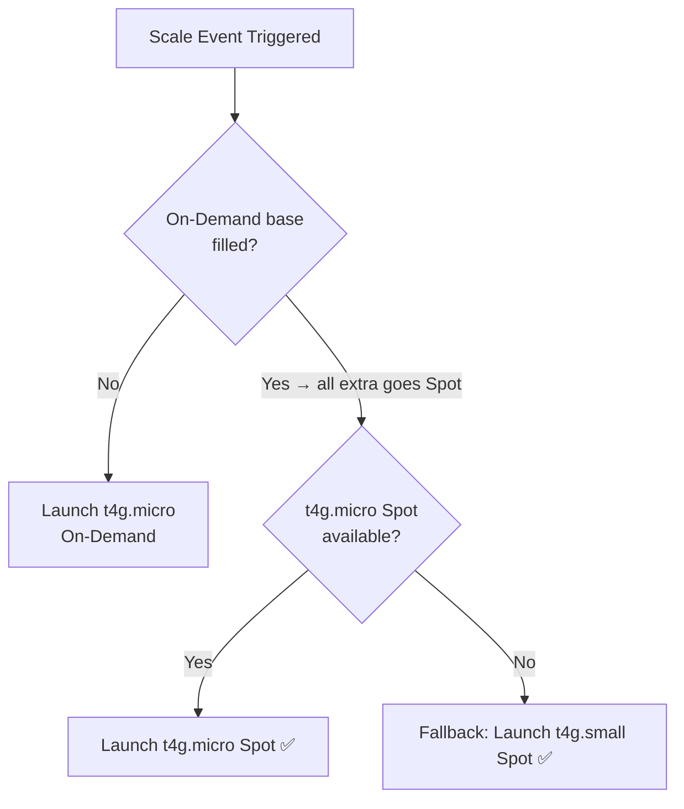

# ECS Self-Managed Instances - ARM64 (Graviton) Terraform

Terraform infrastructure for deploying a containerized application on AWS ECS with self-managed EC2 instances using ARM64/Graviton architecture.

## Architecture

```
Internet → ALB (public) → ECS Task (awsvpc mode, no public IP)
                               ↑
                        EC2 t4g.micro/t4g.small (Graviton, ARM64)
                        Provisioning: 1 On-Demand base + Spot for scale
```

You have **full control** over the EC2 instances — instance type, ASG min/max, and patching. Runs 1 On-Demand base instance for stability, with all scale-out going to Spot.

## Provisioning Model - Mixed Instances

| Scenario | Instance | Cost/month (USD) |
|---|---|---|
| 1 instance (base) | On-Demand t4g.micro | ~$8.50 |
| Scale to 3 instances | 1 On-Demand + 2 Spot | ~$8.50 + ~$5.10 = ~$13.60 |
| Scale to 5 instances | 1 On-Demand + 4 Spot | ~$8.50 + ~$10.20 = ~$18.70 |

- **1 On-Demand base** — always running, never interrupted, stable foundation
- **All scale-up goes to Spot** — up to 70% cheaper than On-Demand
- **Fallback instance types** — `t4g.micro` primary, `t4g.small` if micro Spot unavailable
- **Strategy** — `price-capacity-optimized` for best balance of price + availability

### Instance Type Fallback — How It Works

The ASG uses a **fallback chain**, not both types simultaneously:



| | t4g.micro | t4g.small |
|---|---|---|
| vCPU | 2 | 2 |
| RAM | 1 GB | 2 GB |
| On-Demand price | ~$8.50/mo | ~$17.00/mo |
| Spot price | ~$2.55/mo | ~$5.10/mo |

Same CPU, just double the RAM. Both comfortably fit one 512 MB ECS task. The fallback exists because Spot availability fluctuates — having a second instance type means the ASG is less likely to get stuck during a scale-out event. AWS picks whichever type has the best combination of price and available capacity at that moment (`price-capacity-optimized`).

## Scaling

Uses a **single scaling policy** — ECS managed scaling driven purely by task demand. One clear signal, one decision maker.

| Trigger | Condition | Action |
|---|---|---|
| Task demand | Pending tasks > available capacity | Scale out/in (1–5 instances) |

**How it works:** The ECS capacity provider watches for pending tasks that can't be placed due to insufficient capacity. When it sees them, it signals the ASG to add instances. When tasks free up capacity, it drains and terminates instances.

**Settings:**
- `target_capacity = 100` — scale to exactly meet task demand, no over-provisioning
- `instance_warmup_period = 60s` — new instance waits 60s before being counted in scaling metrics
- `managed_draining = ENABLED` — tasks are gracefully drained before instance termination
- `managed_termination_protection = ENABLED` — prevents ASG from terminating instances that still have running tasks

> Why one policy? Two competing scaling policies (e.g. task demand + CPU) can fight each other — one scales out while the other scales in, leading to flapping. A single task-demand policy gives ECS full, unambiguous control.

## Fargate vs Managed vs Self-Managed

| | Fargate | Fargate + Managed | Fargate + Self-Managed |
|---|---|---|---|
| EC2 under the hood | ❌ | ✅ AWS picks instance | ✅ You pick instance |
| Network mode | awsvpc | awsvpc | awsvpc |
| ALB required | ❌ | ✅ | ✅ |
| Target type | ip | ip | ip |
| You manage patching | ❌ | ❌ | ✅ |
| You manage ASG | ❌ | ❌ | ✅ |
| Spot support | ✅ FARGATE_SPOT | ❌ | ✅ Full control |
| Cost | Highest | Lower | Lowest |

## Infrastructure Overview

| Resource | Details |
|---|---|
| ECS Cluster | Self-managed EC2 capacity provider |
| EC2 Instances | t4g.micro (primary) / t4g.small (fallback) |
| Architecture | Linux/ARM64 (Graviton) |
| Network mode | awsvpc |
| vCPU | 0.25 |
| Memory | 0.5 GB |
| VPC | New VPC (10.0.0.0/16) |
| Subnets | 3 public subnets (ap-southeast-2a/b/c) |
| Task Public IP | ❌ None (`assign_public_ip = false`) |
| ALB Target Type | ip (routes to Task ENI IPs directly) |
| ALB | ✅ Required |
| ASG | ✅ You manage it |
| Provisioning | Mixed (On-Demand base + Spot scale) |

## Files

```
├── alb.tf                        # ALB, target group (ip type), listener
├── cloudwatch.tf                 # CloudWatch log group, SNS topic, alarms
├── cluster.tf                    # ECS cluster, ASG (mixed policy), launch template, capacity provider
├── ecs-self-managed-service.tf   # ECS service (awsvpc network config)
├── iam.tf                        # Task execution role, task role, instance role
├── outputs.tf                    # Output values after apply
├── security-group.tf             # ALB SG (public) + ECS tasks SG (ALB only)
├── task-definition.tf            # ARM64 container definition (awsvpc mode)
├── variables.tf                  # All configurable variables
├── versions.tf                   # Terraform and provider versions
└── vpc.tf                        # VPC, subnets, IGW, route tables
```

## Prerequisites

- [Terraform](https://developer.hashicorp.com/terraform/install) >= 1.0
- AWS CLI configured with credentials
- Docker image pushed to Docker Hub (`rencecaringal000/helloworldarm64:latest`)

## Usage

### Deploy

```bash
terraform init
terraform plan
terraform apply
```

### Confirm SNS email subscription

After `terraform apply`, AWS sends a confirmation email to the address set in `var.alert_email`. **You must click "Confirm subscription" in that email before any alarm notifications are delivered.** Without confirmation, alarms will fire silently.

### Access the app

After apply, the ALB DNS name is printed as output:
```
alb_dns_name = "http://hello-world-arm64-xxxxxx.ap-southeast-2.elb.amazonaws.com"
```

### Destroy

```bash
# Delete everything (CloudWatch logs included by default)
terraform destroy

# Preserve CloudWatch logs on destroy
terraform destroy -var="log_group_skip_destroy=true"
```

> After destroy, manually delete the `/aws/ecs/containerinsights/hello-world-arm64/performance` log group from the CloudWatch console — it is auto-created by Container Insights and not managed by Terraform.

## Variables

| Variable | Default | Description |
|---|---|---|
| `aws_region` | `ap-southeast-2` | AWS region |
| `project_name` | `hello-world-arm64` | Name prefix for all resources |
| `container_image` | `rencecaringal000/helloworldarm64:latest` | Docker Hub image |
| `container_port` | `80` | Container port |
| `task_cpu` | `256` | CPU units (256 = 0.25 vCPU) |
| `task_memory` | `512` | Memory in MB |
| `desired_count` | `1` | Number of ECS tasks to run |
| `asg_min_size` | `1` | ASG minimum instances |
| `asg_max_size` | `5` | ASG maximum instances |
| `asg_desired_capacity` | `1` | ASG desired instances |
| `vpc_cidr` | `10.0.0.0/16` | CIDR block for the VPC |
| `public_subnet_cidrs` | `["10.0.1.0/24", "10.0.2.0/24", "10.0.3.0/24"]` | CIDR blocks for public subnets |
| `availability_zones` | `["ap-southeast-2a", "ap-southeast-2b", "ap-southeast-2c"]` | Availability zones |
| `log_group_skip_destroy` | `false` | Preserve CloudWatch logs on terraform destroy |
| `alert_email` | `lawrencecaringal5@gmail.com` | Email address for CloudWatch alarm notifications |

> **Note:** `host_port` has been removed. In `awsvpc` mode, ECS assigns each task its own ENI, so `containerPort` alone is sufficient — host port mapping is not applicable.

## Monitoring & Alerts

CloudWatch alarms are defined in `cloudwatch.tf`. Notifications are sent via SNS to the email in `var.alert_email`.

| Alarm | Metric | Threshold | Meaning |
|---|---|---|---|
| `alb-unhealthy-hosts` | `UnHealthyHostCount` (max) | > 0 for 2 min | A task failed its health check |
| `alb-5xx-errors` | `HTTPCode_ELB_5XX_Count` (sum) | > 10 in 60s for 2 periods | ALB returning server errors |
| `ecs-low-running-tasks` | `RunningTaskCount` (min) | < 1 for 2 min | Service has no running tasks |
| `ecs-cpu-high` | `CpuUtilized` (avg) | > 80% for 3 min | CPU pressure — consider scaling out |
| `ecs-memory-high` | `MemoryUtilized` (avg) | > 80% for 3 min | Memory pressure — risk of OOM kill |

> The ECS alarms (`ecs-*`) rely on **Container Insights**, which is already enabled on the cluster. Do not disable it.

> **After `terraform apply`:** AWS sends a confirmation email to `lawrencecaringal5@gmail.com`. You must click **Confirm subscription** before any notifications are delivered.

## CI/CD

The Docker image is built and pushed automatically via GitHub Actions on every push or pull request to `main`. The workflow uses a **native ARM64 GitHub-hosted runner** (`ubuntu-24.04-arm`) — no QEMU emulation, no cross-compilation overhead.

`.github/workflows/build-arm64.yml`:

```yaml
name: Build ARM64 and Push to Docker Hub

on:
  push:
    branches:
      - main
  pull_request:
    branches:
      - main

jobs:
  build-and-push:
    runs-on: ubuntu-24.04-arm  # Native ARM64 GitHub-hosted runner

    steps:
      - name: Checkout code
        uses: actions/checkout@v4

      - name: Log in to Docker Hub
        uses: docker/login-action@v3
        with:
          username: ${{ secrets.DOCKERHUB_USERNAME }}
          password: ${{ secrets.DOCKERHUB_TOKEN }}

      - name: Build and Push ARM64 image
        run: |
          docker build -t rencecaringal000/helloworldarm64:latest .
          docker push rencecaringal000/helloworldarm64:latest
```

### Required GitHub Secrets

Add these secrets to your repository under **Settings → Secrets and variables → Actions**:

| Secret | Value |
|---|---|
| `DOCKERHUB_USERNAME` | Your Docker Hub username |
| `DOCKERHUB_TOKEN` | Your Docker Hub password |